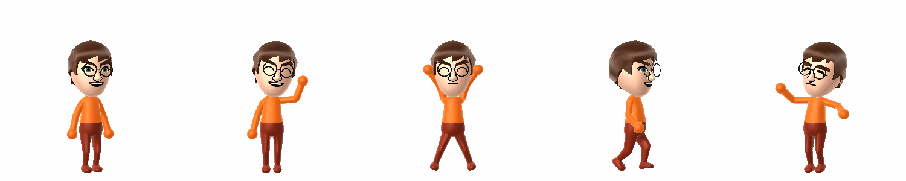
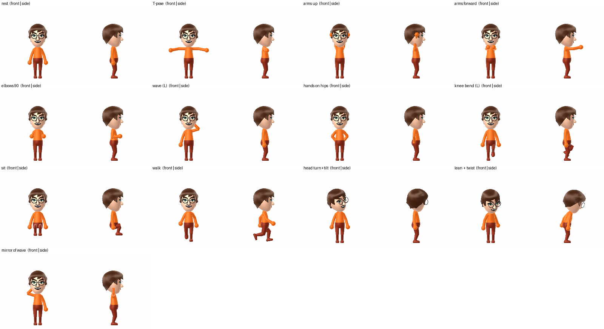
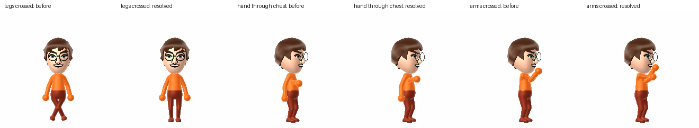
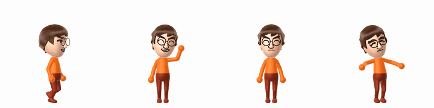
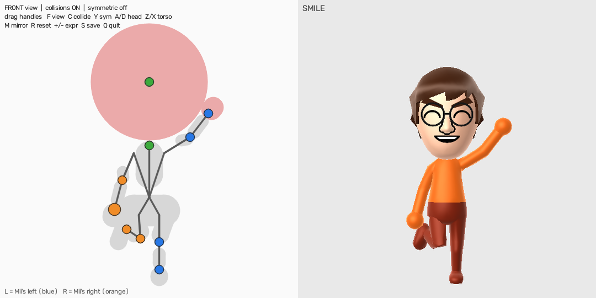
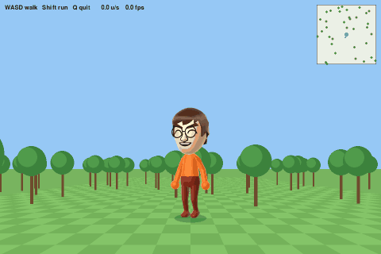

# MiiPy

MiiPy is a Python library that renders Nintendo Miis, from face icons to fully posed and animated bodies. It wraps the [FFL-Testing](https://github.com/ariankordi/FFL-Testing) C++ renderer and handles building and running it for you.



## Features

- **One-call rendering**: face, upper-body and full-body views, in any expression, rotation, size and background.
- **Full-body posing**: pose every joint with one consistent convention. It includes bend and aim helpers, two-bone IK and anatomical joint limits.
- **Self-collision**: limbs are kept out of the torso, hips, head and each other.
- **Animation**: build keyframe clips or procedural motion, and export GIFs.
- **Interactive tools**: a mouse-driven pose editor, a WASD walking simulator and a webcam-driven avatar.
- **Self-building backend**: the C++ renderer compiles itself, with MiiPy's extensions applied as a patch.
- **Flexible input**: `.ffsd` files or raw 96-byte Mii data.

## Installation

The renderer is native code, so you need a C++ toolchain:

```sh
# Debian/Ubuntu
sudo apt-get install git build-essential cmake libglfw3-dev libgl1-mesa-dev
# Windows: Git, CMake and Visual Studio with "Desktop development with C++"
```

Then clone, install and build:

```sh
git clone --recursive https://github.com/davitizhgenti/miipy
cd miipy
pip install -e .
python -m mii build --resource path/to/FFLResHigh.dat
```

- **`FFLResHigh.dat`** is Nintendo's Mii resource file. You must supply it from a legitimate Wii U dump. `--resource` copies it into `FFL-Testing/`. It is not part of this repository and must never be committed.
- **The build** applies `patches/ffl-testing.patch` to the FFL-Testing submodule, then compiles it. The patch adds bone rotations, mouth frames, eyebrow deltas, eye gaze and an upper-body view. If the backend is missing, `MiiPy()` also builds it on first use.

## Quick start

```python
from mii import MiiPy, Expression, ViewType

with MiiPy() as r:
    r.render("mii.ffsd", out="face.png", size=512)
    r.render("mii.ffsd", out="smile.png", expression=Expression.SMILE)
    r.render("mii.ffsd", out="body.png", view=ViewType.ALL_BODY, model_rot=(0, 30, 0))
    img = r.render(open("mii.ffsd", "rb").read())    # raw bytes in, PIL image out
```

**`MiiPy(port=12346, auto_start=True, show_logs=False)`** starts the renderer. It stops automatically when the `with` block exits.

**`render(source, out=None, size=512, **options)`** returns a Pillow image, and also saves it when `out` is given. Common options:

| Option | Meaning |
|---|---|
| `view` | `ViewType.FACE`, `FACE_ONLY`, `UPPER_BODY`, `ALL_BODY` |
| `expression` | `Expression.SMILE`, `SURPRISE`, `WINK_LEFT`, … (including the Miitomo set) |
| `pose` | A `Pose` for full-body views (see below) |
| `model_rot`, `camera_rot` | Rotations `(x, y, z)` in degrees |
| `bg_color` | RGBA background; the default is transparent |
| `clothes_color`, `pants_color` | `ClothesColor.BLUE`, `PantsColor.GRAY`, … |
| `body_type`, `shader_type` | Wii U (default) or Switch body and shading |
| `mouth_frame` | 0–1; above 0.5 switches to the open-mouth version of the expression |
| `eyebrow_delta_y`, `eyebrow_delta_rotate` | Raise, lower or tilt the eyebrows |
| `zoom` | Render resolution before the image is resized to `size` |

Unknown options are ignored with a warning.

**`animate(source, size, **options)`** keeps the settings between frames. Call `.frame(**changes)` to render each frame.

## Posing the body

```python
from mii import MiiPy, Pose, Joint, ViewType

pose = (Pose()
        .aim(Joint.SHOULDER_L, [1, 0.3, 0])   # point the upper arm out and up
        .twist(Joint.SHOULDER_L, -95)         # turn the elbow's bend plane upwards
        .bend(Joint.ELBOW_L, 100)             # wave
        .set(Joint.HIP_R, x=-30).bend(Joint.KNEE_R, 40))

with MiiPy() as r:
    r.render("mii.ffsd", out="wave.png", view=ViewType.ALL_BODY, pose=pose)
    r.render("mii.ffsd", out="mirrored.png", view=ViewType.ALL_BODY, pose=pose.mirror())
```

**Convention** (the same for every joint):

- Rotations are in **body axes**: +X = the Mii's left, +Y = up, +Z = forward. Euler angles are intrinsic X→Y→Z in degrees.
- The pivot is the joint, and a joint's axes move with its parent, so an elbow bend stays an elbow bend however the shoulder is posed.
- Left and right joints take the **same values** for a symmetric pose.

**Joints:**
- `ROOT`, `CHEST`, `NECK`
- `SHOULDER_x` (upper arm), `ELBOW_x` (forearm, hinge), `WRIST_x`
- `HIP_x` (thigh), `KNEE_x` (shin, hinge), `ANKLE_x`

| Method | What it does |
|---|---|
| `set(joint, x, y, z)` / `set_rotation(joint, R)` | Rotate a joint by Euler angles, a matrix or a quaternion |
| `bend(joint, deg)` | Bend an elbow or knee; positive is natural flexion |
| `twist(joint, deg)` | Roll a limb about its length, which turns the plane the elbow or knee bends in |
| `aim(joint, dir)` / `aim_limb(joint, upper, lower)` | Point a segment, or a whole arm or leg, along directions |
| `reach(joint, point)` | Two-bone IK: put a hand or foot at a point |
| `clamp()` | Anatomical limits: hinges bend one way only; hips and chest have separate forward/back/sideways/twist ranges |
| `resolve_collisions()` | Push limbs out of the body (see below) |
| `mirror()`, `lerp(other, t)` | Mirror image, and smooth interpolation between poses |
| `world_positions()` | Joint positions (forward kinematics) |
| `to_dict()` / `Pose.from_dict()` | Save and load poses (for example as JSON) |



## Self-collision

`pose.resolve_collisions()` returns a copy in which the limbs don't pass through the torso, hips, head or each other.

- It pushes limbs out with the smallest shoulder or hip rotation and elbow or knee bend it can, within the joint limits.
- It usually takes a few milliseconds.
- Poses that don't collide come back unchanged.
- The collision shapes are capsules fitted to the real body mesh, plus a sphere matching FFL's head.



**Limitations:**
- The shapes ignore the individual Mii's height and build, so very tall or very wide Miis can still overlap slightly.
- The head is a single sphere, so an unusually big hairstyle can stick out past it.

## Animation

An animation is a keyframe `Clip`, or any function that takes a phase `t` in [0, 1) and returns a `Pose`:

```python
from mii.animation import Clip, render_frames, save_gif

arms_up = Pose().aim(Joint.SHOULDER_L, [0.3, 1, 0]).aim(Joint.SHOULDER_R, [-0.3, 1, 0])
clip = Clip([(0.0, Pose()), (0.5, arms_up)])            # loops back to the start

with MiiPy() as r:
    ctx = r.animate("mii.ffsd", size=320, view=ViewType.ALL_BODY)
    save_gif(render_frames(ctx, clip, 20), "arms.gif", fps=16)
```



`examples/animations.py` renders the four animations above.

## Interactive tools

### Pose editor: `examples/pose_editor.py`

Drag the hands, feet, elbows, knees, head and chest of a skeleton with the mouse, and the Mii render updates live.
- Front and side views.
- Collisions and symmetric editing can be switched on and off.
- Mirror the pose, turn the head, twist the torso, and save poses to JSON.

It needs `pip install opencv-python`.



### Walking simulator: `tests/walk_sim.py`

Walk the Mii around with **WASD**, and hold **Shift** to run.
- The gait is procedural, and its speed is measured from the gait itself, so the feet don't slide.
- The Mii turns smoothly, eases into a standing pose when you stop, and slides around solid trees.

It needs `pip install pygame`.



### Webcam avatar: `examples/vavatar.py`

MediaPipe body and face tracking drives the Mii live:
- arms and legs in 3D;
- head rotation;
- mouth, blinks and eyebrows from face blendshapes.

The tracked pose is smoothed and kept collision-free. The building blocks are `mii.retarget.pose_from_mediapipe()` and `PoseFilter`. It needs `pip install mediapipe opencv-python`.

## Project layout

```
mii/            the library: renderer client (MiiPy), rig (Pose), collision, animation, retarget
examples/       demo, pose sheet, animations, pose editor, webcam avatar
tests/          pytest suite (rig, collision, retarget, animation, golden-image renders) + walk_sim.py
patches/        MiiPy's changes to the FFL-Testing renderer
docs/           README images
FFL-Testing/    renderer (git submodule)
```

## Development

Useful commands:

```sh
python -m mii build                                           # rebuild the renderer
python -m mii build --reset --resource path/to/FFLResHigh.dat # clean submodule, re-apply patch, rebuild
pytest tests                                                  # render tests skip if the renderer isn't built
```

**Changing the C++ renderer:** edit the files in `FFL-Testing/`, then regenerate the patch:

```sh
git -C FFL-Testing diff --binary > patches/ffl-testing.patch
```

The local edits inside the submodule are hidden from `git status` (`ignore = dirty`). The patch file is what gets committed, so remember to regenerate it after editing.

**Low-level bones:** `bones=[BoneOverride(Bone.X, rotate=...)]` still works. Its Euler angles are in each bone's *parent rest axes*. `Bone.ELBOW_x`, `SHOULDER_x` and `KNEE_x` are the joint *spheres*, not the bending segments; use `Pose` and `Joint` instead.

## Troubleshooting

- **Build failure:** a compiler or library is missing; check the installation prerequisites.
- **The renderer fails to start:**
  - check that `FFL-Testing/FFLResHigh.dat` exists;
  - run with `MiiPy(show_logs=True)` to see why;
  - headless Linux may need `xvfb-run`.
- **"Could not apply ffl-testing.patch":** the submodule is at a different commit. Run `python -m mii build --reset`.

## Acknowledgements

This project builds on the FFL-Testing and FFL work by Arian Kordi, and on the wider homebrew and reverse-engineering community.

## License

Released under the MIT License. Nintendo assets such as `FFLResHigh.dat` are not included and remain under their original licenses.

## AI Assistance

Parts of this project were developed with the help of an AI coding assistant, [Claude](https://www.anthropic.com/claude) by Anthropic. It contributed to:
- the pose rig, self-collision, animation and webcam-retargeting modules;
- the interactive tools (pose editor and walking simulator);
- the test suite;
- this README and its images.

The design direction, testing on real hardware and final decisions are the author's.
