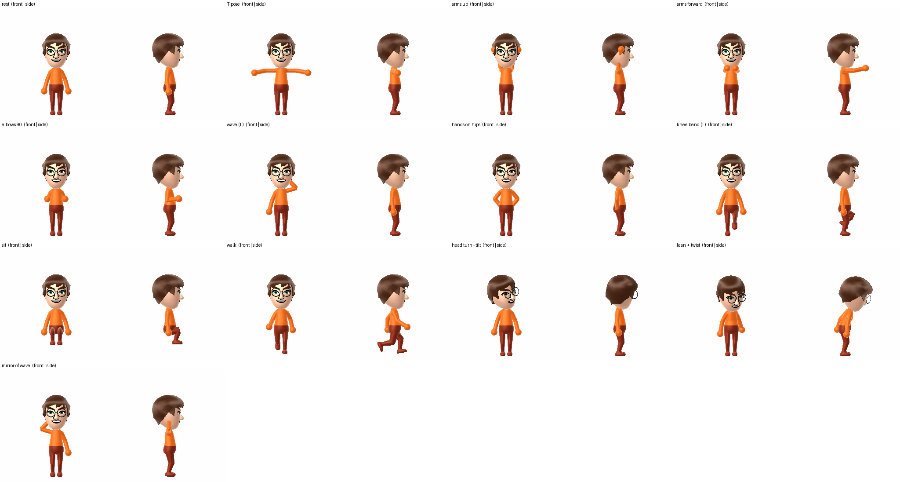

# MiiPy

MiiPy is a Python library that produces clear and sharp images of Nintendo Miis. It wraps the FFL-Testing C++ backend and hides the strain of building and running native code. It lets you focus on the task, not the tools.

## Features

- **Automatic Backend Build**: The renderer builds itself on first use.  
- **Clean Python API**: A single call renders a Mii.  
- **Flexible Input**: Accepts `.ffsd` files or raw 96-byte data.  
- **Rich Rendering Options**: Control size, zoom, expression, and view.  
- **Full-Body Posing**: Pose arms, legs, torso and head with one consistent joint convention, animate with keyframes, or drive the Mii from a webcam.  
- **Cross-Platform**: Works on Linux and Windows.  
- **Managed Resources**: The backend starts and stops on its own and cleans up temporary files.

## Prerequisites

The backend is native code, so you need a working C++ build setup.

### Windows

- Git  
- CMake  
- Visual Studio with the “Desktop development with C++” workload  

### Linux (Debian/Ubuntu)

```sh
sudo apt-get update
sudo apt-get install git build-essential cmake libglfw3-dev libgl1-mesa-dev
```

## Installation

> **Note:** Not yet published to PyPI.

```sh
git clone --recursive https://github.com/davitizhgenti/miipy
cd miipy
pip install -e .
python -m mii build --resource path/to/FFLResHigh.dat
```

The build applies miipy's backend changes (`patches/ffl-testing.patch`: bone
rotations, mouth frames, eyebrow deltas, eye gaze, upper-body view) to the
FFL-Testing submodule, then compiles it. If the backend is missing, `MiiPy()`
also builds it on first use.

## Usage

### Step 1: Required Resource File

You must supply **FFLResHigh.dat**, obtained from a legitimate Wii U dump.
Copy it into the `FFL-Testing` folder, or pass `--resource` to `python -m mii build`.
It is not included in this repository and must never be committed.

### Step 2: Basic Example

```python
from mii import MiiPy, Expression, ViewType
import os

MII_FILE = "path/to/your/mii.ffsd"

try:
    with MiiPy() as renderer:
        # Simple face render
        renderer.render(
            source=MII_FILE,
            out="my_mii.png",
            size=512
        )

        # Smiling expression returned as PIL Image
        img_obj = renderer.render(
            source=MII_FILE,
            expression=Expression.SMILE,
            zoom=800
        )
        img_obj.save("smile.png")

        # Full body render (needs strong zoom-out)
        renderer.render(
            source=MII_FILE,
            out="body.png",
            view=ViewType.ALL_BODY,
            size=512,
            zoom=1200
        )

        # Render from raw bytes
        with open(MII_FILE, "rb") as f:
            data_bytes = f.read()

        renderer.render(
            source=data_bytes,
            out="from_bytes.png"
        )

except (FileNotFoundError, RuntimeError) as e:
    print(f"An error occurred: {e}")
```

## API Reference

### `MiiPy(port=12346, show_logs=False)`

Main class for rendering Miis.

* **port**: TCP port for the backend.
* **show_logs**: Print backend logs.

### `renderer.render(source, out=None, size=512, **kwargs)`

Render a single image.

* **source**: Path to a `.ffsd` file or raw 96-byte data.
* **out**: Output PNG path. If `None`, returns a Pillow Image.
* **size**: Final image resolution.
* **kwargs**: Extra render controls. Common options:

  * `zoom`: Field-of-view control. Higher values pull the camera back.
  * `expression`: A facial expression (`Expression.SMILE`, etc.).
  * `view`: Which part to render (`ViewType.ALL_BODY`, etc.).
  * `clothes_color`: Shirt color (`ClothesColor.BLUE`).
  * `model_rot`: A rotation tuple `(X, Y, Z)`.

## Posing the Body

Use `Pose` with `Joint` to pose full-body renders (`ViewType.ALL_BODY` / `UPPER_BODY`, Wii U and Switch bodies):

```python
from mii import MiiPy, Pose, Joint, ViewType

pose = (Pose()
        .aim(Joint.SHOULDER_L, [1, 0.3, 0])   # point the upper arm out and up
        .twist(Joint.SHOULDER_L, -95)         # turn the elbow's bend plane upwards
        .bend(Joint.ELBOW_L, 100)             # wave
        .set(Joint.HIP_R, x=-30).bend(Joint.KNEE_R, 40))

with MiiPy() as r:
    r.render("mii.ffsd", out="wave.png", view=ViewType.ALL_BODY, pose=pose)
    r.render("mii.ffsd", out="wave_mirrored.png", view=ViewType.ALL_BODY, pose=pose.mirror())
```

**Convention** (the same for every joint):

* Rotations are in body axes at rest: +X = the Mii's left, +Y = up, +Z = forward.
* Euler angles are intrinsic X→Y→Z in degrees.
* The pivot is the joint. A joint's axes move with its parent, so an elbow bend stays an elbow bend however the shoulder is posed.
* Left and right joints take the **same values** for a symmetric pose.

**Joints:**
* `ROOT`, `CHEST`, `NECK`
* `SHOULDER_x` (upper arm), `ELBOW_x` (forearm, hinge), `WRIST_x`
* `HIP_x` (thigh), `KNEE_x` (shin, hinge), `ANKLE_x`

**Tools:**
* `bend()` bends a hinge; a positive value is natural flexion.
* `aim()` points a segment along a direction.
* `aim_limb()` aims a whole arm or leg from two directions.
* `clamp()` applies anatomical limits.
* `lerp()` interpolates between poses for animation.
* `world_positions()` returns joint positions (forward kinematics).

**Self-collision:** `pose.resolve_collisions()` returns a copy in which limbs don't pass through the torso, hips, head or each other. It pushes them out with the smallest shoulder/hip rotation and elbow/knee bend it can, and it usually takes a few milliseconds.

* The colliders are capsules fitted to the real body mesh, plus a sphere for the FFL head.
* Poses that don't collide are returned unchanged.
* Webcam retargeting applies it by default.
* The colliders ignore the individual Mii's height and build. Very tall or very wide Miis can still clip slightly, and an unusually large hairstyle can reach past the head sphere.

```python
pose = Pose().aim(Joint.SHOULDER_L, [-0.6, -0.4, 0.2]).bend(Joint.ELBOW_L, 30)  # hand through chest
r.render("mii.ffsd", out="fixed.png", view=ViewType.ALL_BODY, pose=pose.resolve_collisions())
```

`mii.retarget.pose_from_mediapipe()` builds a `Pose` from MediaPipe `pose_world_landmarks`. See `examples/vavatar.py` for a webcam demo that uses the MediaPipe Tasks API.



`examples/pose_sheet.py` renders a sheet of reference poses for visual review. The tests are in `tests/`. Run them with `pytest tests`; the render tests skip themselves if the backend isn't built.

The low-level `bones=[BoneOverride(Bone.X, ...)]` still works. Its Euler angles are in each bone's *parent rest axes*, and `ELBOW_x`, `SHOULDER_x` and `KNEE_x` in `Bone` are the joint *spheres*, not the bending segments.

## Troubleshooting

* **Build failure**: Missing compilers or libraries. Check prerequisites.
* **Backend fails to start**:

  * Ensure `FFLResHigh.dat` exists in `FFL-Testing`.
  * Check file permissions or corruption.
  * Headless Linux may require `xvfb-run`.
* **Git submodule errors**: Verify Git and network access.

## For Developers

Rebuild manually:

```sh
python -m mii build
```

Do a full reset (discards local submodule edits, then re-applies the patch) and rebuild:

```sh
python -m mii build --reset --resource path/to/FFLResHigh.dat
```

Run the tests (`pip install pytest`). Render tests are skipped if the backend isn't built:

```sh
pytest tests
```

**Changing the C++ backend:** edit files in `FFL-Testing/`, then regenerate the patch:

```sh
git -C FFL-Testing diff --binary > patches/ffl-testing.patch
```

## Acknowledgements

This project builds on the FFL-Testing work by Arian Kordi and the wider homebrew and reverse-engineering community.

## License

Released under the MIT License.

**Note:** Nintendo assets such as `FFLResHigh.dat` are not included and remain under their original licenses.
